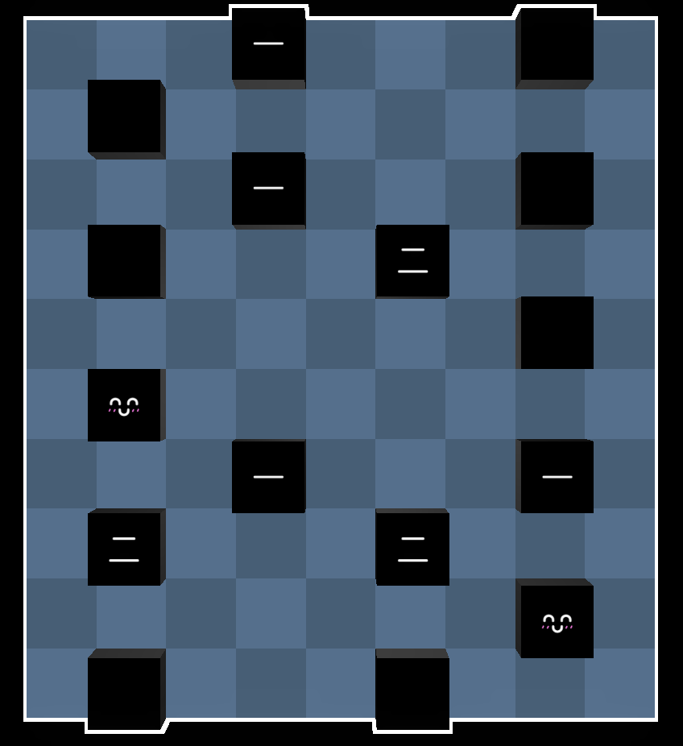
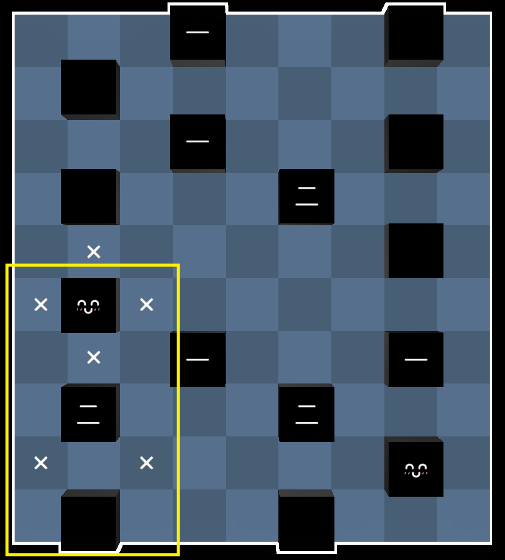
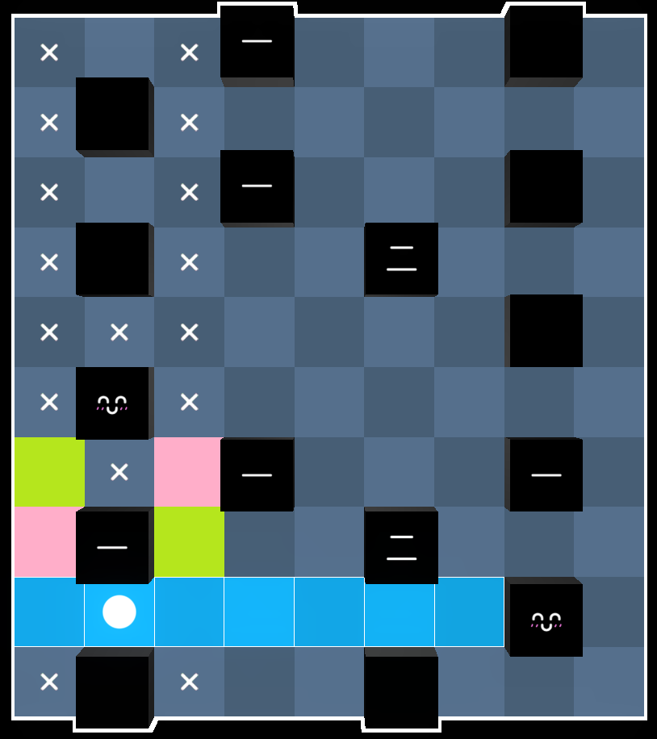
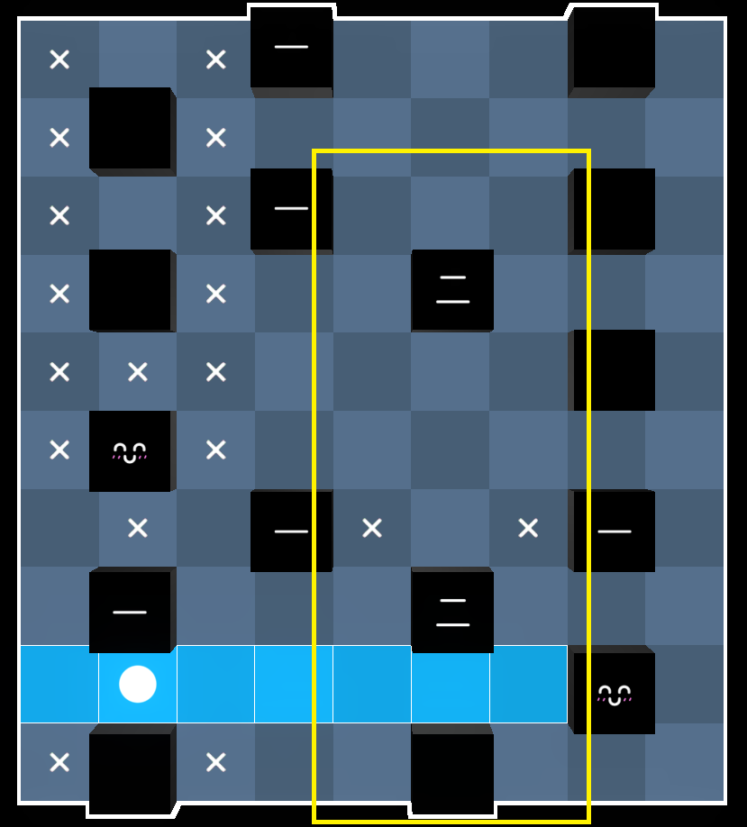
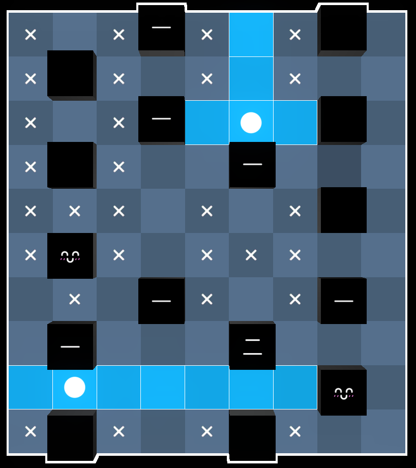
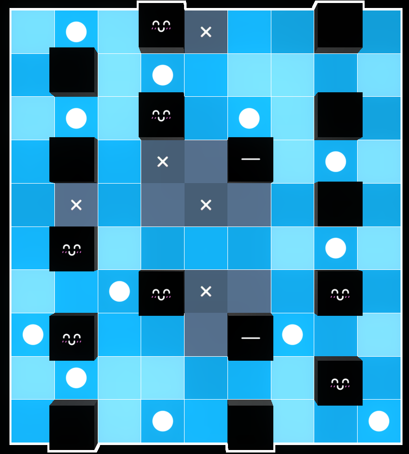
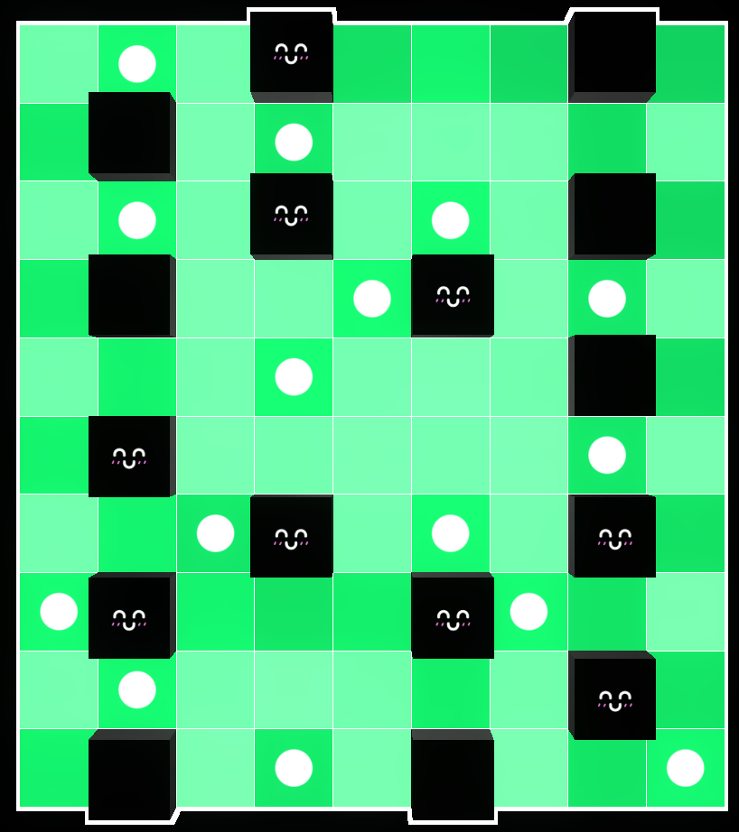

# 概要
9月4日 の [Daily Akari](https://dailyakari.com/) の Writer だった。
解法や作問過程などを簡単に説明する。

# 解説
ネタバレ注意（スクロールするとすぐに解法が画面に表示される）。
## 初期配置

最初に壁の配置を決め、そこに数字を記入していく方法で問題を作成した。

作問するなら難しい問題にしたいと思い、過去の問題で自分が難しいと感じたものを考えたところ、
[No. 161](https://dailyakari.com/archive/161) や [No. 229](https://dailyakari.com/archive/229) が思い当たった。
この問題もこれらに似たような形の盤面にした。

## 想定解法と作問過程

最初の一手を決める際に様々な配置を試したところ、囲った部分の配置によって確定する範囲が広かったのでこれを採用した。

確定する範囲は上記の通り（ピンク色の部分に2つまたは緑色の部分に2つ）。

もう一度同様の構造があると嬉しいのでこのような配置にした。

以上の二つが分かるとしばらくは道なり。

最後に混乱を与える配置が残ったのは偶然。二択を読み切る必要がある。SNS にはここで Perfect を逃したと思しきリザルトがいくつか投稿されていた。

解答。

# 感想
- Very Hard にするつもりで作問を開始したが、結局 Hard ぐらいの難易度になった。自分の解けない問題は作れない。
- （投稿前にチェックはしたとは言え）想定外の解法によってあまりにも簡単に解かれることを心配していたが、そのようなことはなかったようで安心した。
- SNSに投稿されていた感想を読んだところ面白いと言ってくれた方がいて嬉しかった。
- 9月4日 に公開されることは事前に把握していた。Daily Akari は一週間で一つのセットになっていて、月曜日から日曜日になるにかけて問題が難しくなるとされている[^1][^2]。そのため [9月3日 の問題](https://dailyakari.com/archive/241) はこの問題より易しいと予想していたが、実際はかなり難しく内心かなり焦っていた。

# おまけ
実は二つ問題を作っていた。投稿しなかった方の問題をここに投稿する。

https://puzz.link/p?akari/9/9/g.g.g..g6cucg6.h.k.h6bgbu6.g.6.g.g

[^1]: https://x.com/singfishergames/status/1911163821198127178
[^2]: https://x.com/singfishergames/status/1930719691343032760